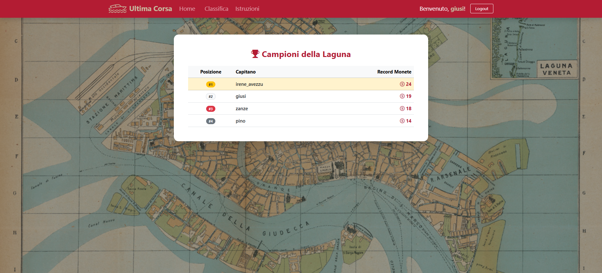
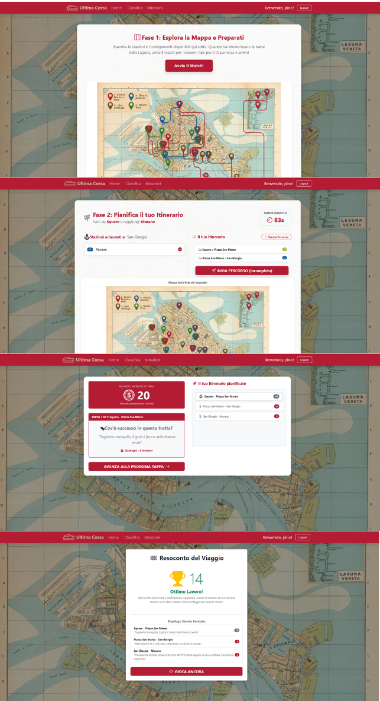

# Exam #1: "Ultima Corsa"
Per questa mia versione personale di "Race the Trails" ho scelto come ambientazione la città di Venezia con riferimenti a lughi e possibili eventi che fanno parte della cultura e la storia di questa città.

## React Client Application Routes

- **Route `/`**: Pagina principale dell'applicazione. Se l'utente è anonimo, mostra esclusivamente le istruzioni di gioco (senza mostrare la mappa della rete). Se l'utente è registrato e autenticato, mostra il componente contenitore principale `GameManager`, il quale gestisce e fa evolvere dinamicamente l'interfaccia attraverso le 4 fasi della partita corrente senza cambiare URL:
  - *Fase 1 (Setup)*: renderizzazione della mappa metropolitana completa e del pulsante per avviare il match
  - *Fase 2 (Pianificazione)*: misualizzazione della mappa senza linee, nodi di partenza/arrivo e timer di 90 secondi per la selezione delle tratte
  - *Fase 3 (Esecuzione)*: display sequenziale e interattivo delle tappe del viaggio con i relativi eventi casuali e l'aggiornamento del punteggio
  - *Fase 4 (Risultato)*: schermata di riepilogo con il punteggio finale e il pulsante per iniziare una nuova partita
- Route `/ranking`: accessibile solo agli utenti loggati tramite navbar, mostra la classifica generale con i migliori punteggi di ciascun giocatore
- Route `/login`: pagina con il form di autenticazione per gli utenti registrati
- Route `/register`: pagina con il form per la creazione di un nuovo account (username, password)

## API Server

- **POST `/api/sessions`**
  - Autentica l'utente tramite Passport.js (login).
  - Request body: `{ "username": "user1", "password": "password" }`
  - Response body: 
    - HTTP 200 o errore HTTP 401
  ```
  { 
    "id": 1, 
    "username": "user1", 
    "name": "Mario" 
  }
  ```

- **DELETE `/api/sessions/current`**
  - Effettua il logout dell'utente corrente invalidando la sessione
  - Richiesta: nessuna (usa il cookie di sessione)
  - Risposta: vuota 
    - HTTP 204

- **GET `/api/sessions/current`**
  - Controlla se l'utente ha una sessione attiva (utile al refresh/mount del client)
  - Richiesta: nessuna
  - Response body: info dell'utente attualmente loggato o status 401
    - HTTP 200 o errore HTTP 401
 ```
  { 
    "id": 1, 
    "username": "user1" 
  }
  ``` 

- **GET `/api/network`**
  - Recupera la struttura fissa della rete metropolitana (stazioni, linee e collegamenti)
  - Richiesta: nessuna (protetta da auth)
  - Response body: array di stazioni e array di collegamenti/linee per disegnare la mappa
    - HTTP 200
  ```
  { "stations": [...], 
    "lines": [...], 
    "connections": [...] 
  }
  ```


- **POST `/api/games/start`**
  - Avvia una nuova partita per l'utente loggato, generando e memorizzando sul server una stazione di partenza e una di arrivo tra le quali l'utente dovrà pianificare il viaggio (distanza $\ge 3$ fermate)
  - Richiesta: nessuna (protetta da auth)
  - Response body: partita creata con stazione di partenza, stazione di arrivo (distanza $\ge 3$) e lista di tutte le tratte disponibili
    - HTTP 200
  ```
  { "gameId": 42, 
    "startStation": "Piazza San Marco", 
    "endStation": "Rialto", 
    "connectionsList": [...] 
  }
  ```
  
- **GET `/api/ranking`**
  - Restituisce la classifica globale contenente il miglior punteggio (High Score) di ciascun utente registrato
  - Richiesta: nessuna (protetta da auth)
  - Response body: classifica ordinata dei migliori punteggi degli utenti
    - HTTP 200
  ```
  [ {"username": "user1", 
    "maxScore": 24 
    }, 
    { "username": "user2", 
    "maxScore": 18 
    }
  ]
  ```

- **POST `/api/games/:id/validate`**
  - Riceve il percorso pianificato dall'utente entro i 90 secondi, lo valida sul server e calcola gli eventi casuali per ogni tratta. Se non valido/incompleto, assegna 0 punti. Salva la partita nel DB
  - Parametri di richiesta: `:id` nel path (l'ID della partita ottenuto dallo start) 
  - Request body: array del percorso scelto dal giocatore
  ```
  { "route": ["Rialto-Zattere", "Zattere-San Giorgio", ...] }
  ```
  - Response body: esito della validazione, calcolo delle monete e lista degli eventi causali applicati 
    - HTTP 200
  ```
  { "valid": true, 
  "score": 22, 
  "stages": 
    [ { "tratta": "...", 
      "event": "...", 
      "delta": 1, 
      "currentCoins": 21 }, 
      ... 
    ] 
  }
  ``` 

- **POST `/api/users`**
  - Registra un nuovo utente nel database, memorizzando la password in formato hashed con sale.
  - Request body: 
  ```
  { 
    "username": "nuovo_utente", 
    "password": "passwordSicura123" 
  }
  ```
  - Response body: 
    - HTTP 201 o errore di validazione/duplicazione HTTP 400 / 409
  ```
  { 
    "id": 4, 
    "username": "nuovo_utente" }
  ```

## Database Tables

- Table `users`: contiene le credenziali degli utenti registrati 
  - `id` (PK), `username` (univoco), `hash` (password cifrata con sale), `salt`
- Table `stations`: memorizza le stazioni della rete metropolitana 
  - `id` (PK), `name` (univoco)
- Table `lines`: elenco delle linee della metropolitana 
  - `id` (PK), `name` (univoco), `color`(univoco)
- Table `connections`: associa le stazioni tra loro e alla tratta corrispondente 
  - `id` (PK), `station_start_id`, `station_end_id`, `line_id`
- Table `events`: contiene la lista degli eventi casuali di gioco 
  - `id` (PK), `description`, `effect_value` (valore intero da -4 a +4)
- Table `games`: memorizza lo storico delle partite giocate per stilare la classifica
  - `id` (PK), `user_id` (FK), `score` (punteggio finale $\ge 0$)


## Main React Components
- `App` (in `App.jsx`): componente radice. Gestisce lo stato globale dell'autenticazione utente (`user`), il caricamento iniziale dei dati di rete, definisce il routing dell'applicazione e renderizza il footer
- `Navigation` (in `Navigation.jsx`): barra di navigazione superiore che mostra i link alle pagine (home, classifica, istruzioni) e i pulsanti di login e logout
- `LoginForm` (in `LoginForm.jsx`): gestisce il form controllato per l'inserimento di username e password, eseguendo la validazione dei campi in locale prima dell'invio al server
- `RegisterForm` (in `RegisterForm.jsx`): controlla l'input dei dati di registrazione, eseguendo la validazione dei campi in locale prima dell'invio al server
- `GameManager` (in `GameManager.jsx`): componente contenitore principale del gioco, è integrato nella route `/`. Gestisce la transizione di stato tra le 4 fasi (setup, pianificazione del percorso, esecuzione con bunus e malus, risultato) senza variazioni di URL, conservando lo stato dei punteggi, del percorso corrente e dei dati della partita attiva
- `SetupPhase` (in `SetupPhase.jsx`): renderizza la fase iniziale di gioco, mostrando le regole (per l'utente anonimo) o renderizzando la mappa della rete e i suoi componenti (stazioni e linee) per gli utenti loggati
-  `PlanningPhase` (in `PlanningPhase.jsx`): gestisce la fase di pianificazione del gioco. Renderizza la mappa con solamente le fermate (senza le connessioni) e permette all'untente di scegliere il percorso da compiere evendo sempre a disposizione il timer
- `ExecutionPhase` (in `ExecutionPhase.jsx`): gestisce la fase di esecuzione del percorso completato allo step precedente. Per ogni tratta seleziona bonus o malus e ripercorre con l'utente ogni fermata aggiornando il valore delle monete
- `RankingTable` (in `RankingTable.jsx`): renderizza la pagina della classifica, perzonalizzando i tag del podio con i colori corrispondenti (oro, argento, bronzo) ordinando le partite (una per utente) in ordine decrescente di punteggio

## Screenshots

### Classifica Generale


### Durante una Partita (Fase Pianificazione)



## Users Credentials
Nel database SQLite pre-caricato sono inseriti i seguenti 3 utenti registrati (tutti con password `password`), di cui due provvisti di storico partite completate con successo:
- **utente1** (`username: irene_avezzu`, `password: password`) - Ha giocato 3 partite, miglior punteggio: 24 monete 
- **utente2** (`username: zanze`, `password: password`) - Ha giocato 2 partite, miglior punteggio: 18 monete 
- **utente3** (`username: laerica`, `password: password`) - Nuovo utente registrato, nessuna partita nello storico

Inoltre nel database sono stati aggiunti due giocatore creati tramite interfaccia web con le seguenti credenziali e punteggio di gioco:
- **utente4** (`username: pino`, `password: psw123`) - Ha giocato 1 partita, miglior punteggio 14
- **utente5** (`username: giusi`, `password: pswProva`) - Ha giocato 1 partita, miglior punteggio 19


## Use of AI Tools

Ho utilizzato Gemini-Flash per supportare alcune fasi dello sviluppo di questo progetto.  
Inizialmente l'ho utilizzato per creare una check list ordinata per ottimizzare lo sviluppo dell'applicazione in modo ordinato.  
Nello sviluppo dell'appicazione stessa, l'ho utilizzato come supporto per risolvere alcuni errori che ho incontrato nel processo di sviluppo, tendenzialmente relativi a librerie da importare e l'algoritmo di ricerca delle tratte. Inoltre l'ho utilizzato per risolvere alcuni import di immagini che non risultavano visibili a tutti i componenti dell'app.
Infine l'ho utilizzato per alcuni piccoli aspetti estetici come l'inserimento del logo nella scheda e di alcune icone.

## Note
Per eseguire l'applicazione.

**Front-end**
```bash
cd client
npm install
npm run dev
```
**Back-end**
```bash
cd server
npm install
nodemom index.jsx
```
